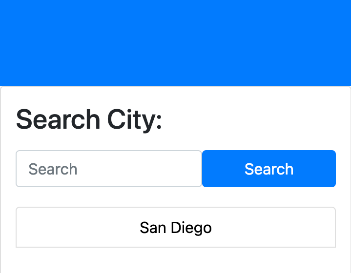
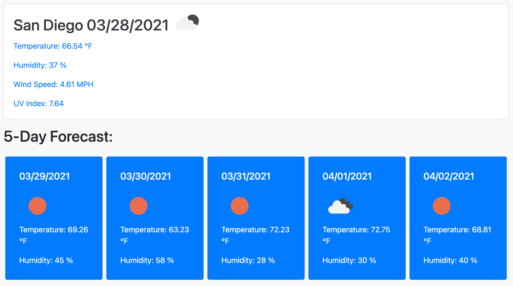
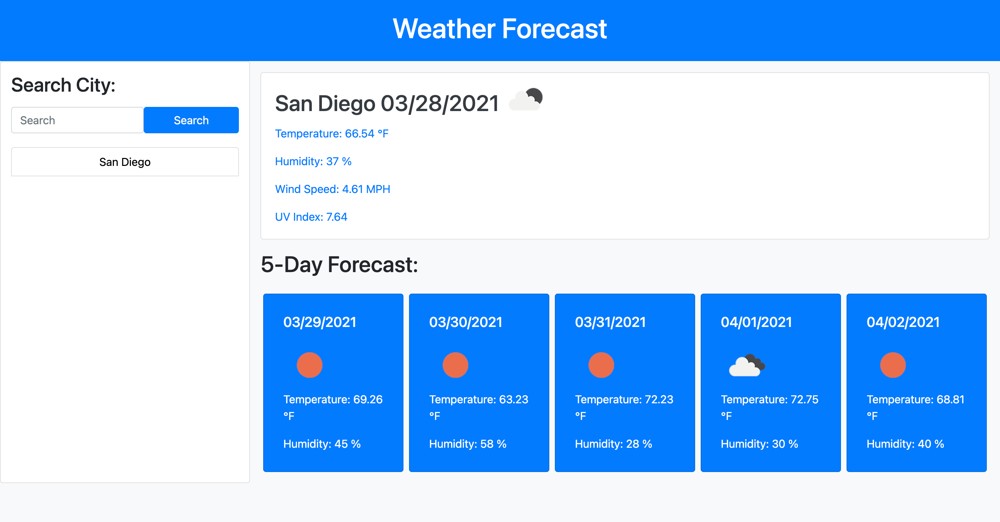
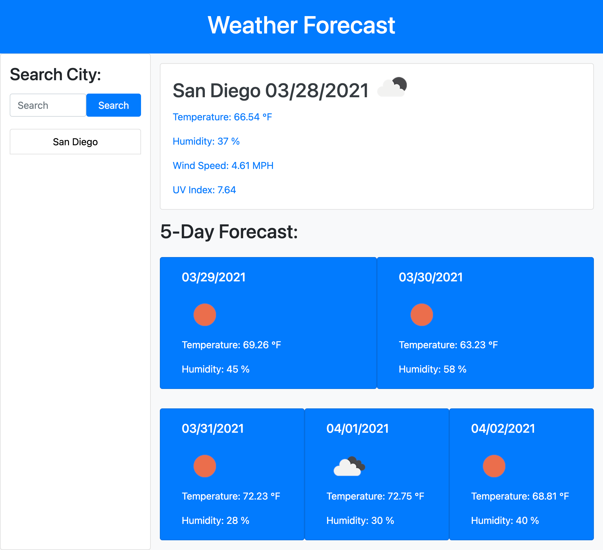
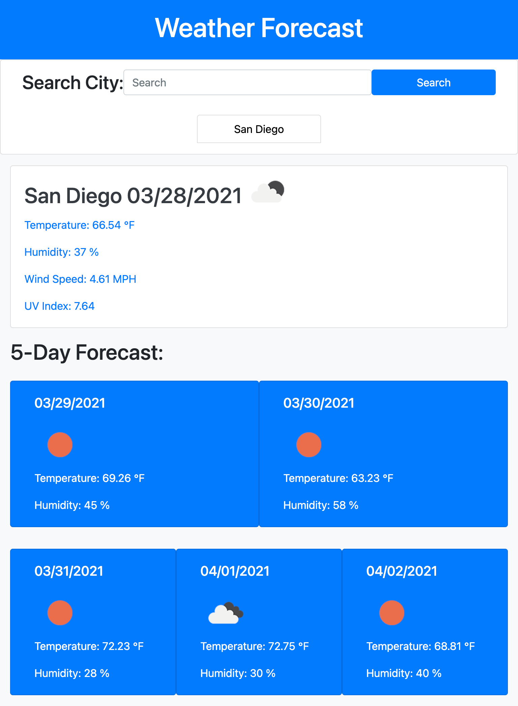
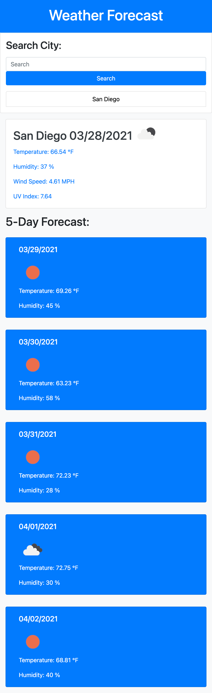

# Weather Forecast Page

## Description

- In this project I created a Desktop, laptop, tablet and mobile responsive weather forecast webpage.
- The layout was created using Bootstrap v4.
- The weather data was provided using Jquery and Openweather API.
- I really tested myself creating this webpage when it came to Javascript and Jquery beacuse it is an area I lack in.
- None the less I feel very proud of the page I created and Learned a lot in the process.
- I learned how to properly use Jquery functions and syntax, Bootstrap design and Javascript syntax.

## Installation

- Clone the Repo in your Terminal (for Mac) or Bash(for PC).
- Using SSH key: git clone git@github.com:Eniqma69/weatherPage.git
- Using HTTPS key: git clone https://github.com/Eniqma69/weatherPage.git

## Usage

### To start off you have a search bar where you can type in any city for a 6 day forecast of the weather.

### Each city you search will get saved up to 8 cities for future use.

### This is the weather forecast that will be displayed showing the date, weather condition, temperature, wind speed, uv index and humiditiy.

### This is the responsive Desktop layout.

### This is the responsive Laptop layout.

### This is the responsive Tablet layout.

### This is the responsive Mobile layout.

## Credits

- https://getbootstrap.com/
- https://stackoverflow.com/
- https://openweathermap.org/api
- https://learn.jquery.com/
- https://www.w3schools.com/
- https://developer.mozilla.org/en-US/
- https://www.javascript.com/
- https://www.google.com/
- Chrome Dev Tools

## License

- MIT License
  Copyright (c) [2021] [Javier Perez]
- Permission is hereby granted, free of charge, to any person obtaining a copy
  of this software and associated documentation files (the "Software"), to deal
  in the Software without restriction, including without limitation the rights
  to use, copy, modify, merge, publish, distribute, sublicense, and/or sell
  copies of the Software, and to permit persons to whom the Software is
  furnished to do so, subject to the following conditions:
  The above copyright notice and this permission notice shall be included in all
  copies or substantial portions of the Software.
  THE SOFTWARE IS PROVIDED "AS IS", WITHOUT WARRANTY OF ANY KIND, EXPRESS OR
  IMPLIED, INCLUDING BUT NOT LIMITED TO THE WARRANTIES OF MERCHANTABILITY,
  FITNESS FOR A PARTICULAR PURPOSE AND NONINFRINGEMENT. IN NO EVENT SHALL THE
  AUTHORS OR COPYRIGHT HOLDERS BE LIABLE FOR ANY CLAIM, DAMAGES OR OTHER
  LIABILITY, WHETHER IN AN ACTION OF CONTRACT, TORT OR OTHERWISE, ARISING FROM,
  OUT OF OR IN CONNECTION WITH THE SOFTWARE OR THE USE OR OTHER DEALINGS IN THE
  SOFTWARE.
